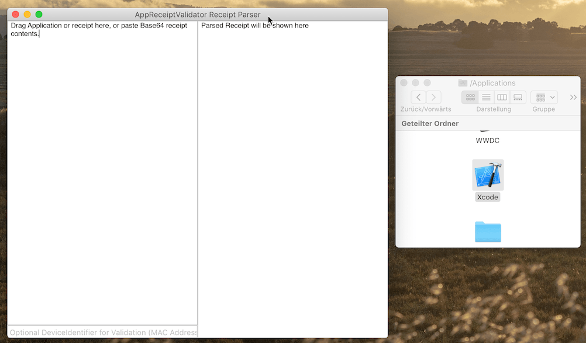

# AppReceiptValidator

[](https://github.com/Carthage/Carthage)


[](LICENSE)
[](https://travis-ci.org/IdeasOnCanvas/AppReceiptValidator)
[](https://twitter.com/hannesoid)


An iOS and macOS library intended for dealing with App Store receipts, offering basic local retrieval, validation and parsing of receipt files.

Provides Demo Apps on iOS and macOS to inspect receipt files.


## Integration with Carthage

Add this line to your Cartfile.
```
github "IdeasOnCanvas/AppReceiptValidator"
```

## Usage in Code

Apple advises to write your own code for receipt validation, and build and link OpenSSL statically to your app target. Anyways this repo might be a starting point for you, or be used as a dependency at your own risk, or might just be helpful for you to inspect receipts.

### Just parsing a receipt

```swift
let receiptValidator = AppReceiptValidator()

let installedReceipt = receiptValidator.parseReceipt(origin: .installedInMainBundle)

let customReceipt = receiptValidator.parseReceipt(origin: .data(dataFromSomewhere))
```

Result may look like this:

```
Receipt(
    bundleIdentifier: com.some.bundleidentifier,
    bundleIdData: BVWNwKILNEWPOJWELKWEF=,
    appVersion: 1,
    opaqueValue: xN1AVLC2Gge+tYX2qELgSA==,
    sha1Hash: LgoRW+rBxXAjpb03NJlVqa2Z200=,
    originalAppVersion: 1.0,
    receiptCreationDate: 2015-08-13T07:50:46Z,
    expirationDate: nil,
    inAppPurchaseReceipts: [
    InAppPurchaseReceipt(
        quantity: nil,
        productIdentifier: consumable,
        transactionIdentifier: 1000000166865231,
        originalTransactionIdentifier: 1000000166865231,
        purchaseDate: 2015-08-07T20:37:55Z,
        originalPurchaseDate: 2015-08-07T20:37:55Z,
        subscriptionExpirationDate: nil,
        cancellationDate: nil,
        webOrderLineItemId: nil
    ),
    InAppPurchaseReceipt(
        quantity: nil,
        productIdentifier: monthly,
        transactionIdentifier: 1000000166965150,
        originalTransactionIdentifier: 1000000166965150,
        purchaseDate: 2015-08-10T06:49:32Z,
        originalPurchaseDate: 2015-08-10T06:49:33Z,
        subscriptionExpirationDate: 2015-08-10T06:54:32Z,
        cancellationDate: nil,
        webOrderLineItemId: nil
    )
    ]
)
```

**Receipt** is *Equatable*, so you can do comparisons in Unit Tests.
There are also some opt-in unofficial attributes, but this is experimental and should not be used in production.

### Validating a receipt's signature and hash

```swift
// Full validation of signature and hash based on installed receipt
let result = receiptValidator.validateReceipt()

switch result {
    case .success(let receipt, let receiptData, let deviceIdentifier):
    print("receipt validated and parsed: \(receipt)")
    print("the retrieved receipt file's data was: \(receiptData.count) bytes")
    print("the retrieved deviceIdentifier is: \(deviceIdentifier)")
    case .error(let validationError, let receiptData, let deviceIdentifier):
    print("receipt not valid: \(validationError)")
    // receiptData and deviceIdentifier are optional and might still have been retrieved
}
```


### Customize validation dependencies or steps

Take `AppReceiptValidator.Parameters.default` and customize it, then pass it to `validateReceipt(parameters:)`, like so:

```swift
// Customizing validation parameters with configuration block, base on .default
let parameters = AppReceiptValidator.Parameters.default.with {
    $0.receiptOrigin = .data(myData)
    $0.shouldValidateSignaturePresence = false // skip signature presence validation
    $0.signatureValidation = .skip // skip signature authenticity validation
    $0.shouldValidateHash = false // skip hash validation
    $0.deviceIdentifier = .data(myCustomDeviceIdentifierData)

    // validate some string properties, this can also be done 
    // independently with validateProperties(receipt:, validations:)
    // There are also shorthands for comparing with main bundle's 
    // info.plist, e.g. bundleIdMatchingMainBundle and friends.
    // Note that appVersion meaning is platform specific.
    $0.propertyValidations = [
        .string(\.bundleIdentifier, expected: "my.bundle.identifier"),
        .string(\.appVersion, expected: "123"),
        .string(\.originalAppVersion, expected: "1")
    ]
}

let result = AppReceiptValidator().validate(parameters: parameters)

// switch on result
```

## Demo Apps

Paste base64-encoded receipt data into the macOS or iOS demo app to see what AppReceiptValidator parses from it. The macOS App supports:

- Drag n Drop an application or its receipt file onto it to inspect



## StoreKit Hints

This framework currently doesn't deal with StoreKit. But the receipt file might not exist at all. What now?

If you have no receipt (happens in development builds) or your receipt is invalid, see resources on how to update it using StoreKit functionality. Known caveats:

- `SKReceiptRefreshRequest` might not complete on certain macOS Versions, but reliable on iOS - [openradar](https://openradar.appspot.com/radar?id=4998688879411200)
- `SKPaymentQueue.restoreCompletedTransactions()` might not update the the receipt, especially if no IAPs were made or the receipt is valid - [openradar](https://openradar.appspot.com/radar?id=6080726030090240)
- `exit(173)` only works on macOS
- Make some kind of purchase, i.e. App Store transaction, to update it
- Each mechanism of receipt refresh will be intrusive to the user, mostly asking for AppleID password.
- Apple advises to write your own code for receipt validation, and build and link OpenSSL statically to your app target. Anyways this repo might be a starting point for you.
- Also have a look at [SwiftyStoreKit](https://github.com/bizz84/SwiftyStoreKit) for dealing with StoreKit, interpretation of receipts, server-verification, and more

## How it Works

### AppReceiptValidator Uses OpenSSL

OpenSSL is used for PKCS#7 container parsing and signature validation, and also for parsing the ASN1 payload of the PKCS#7, which contains the receipts attributes.

### Other Options

##### Alternatives to PKCS#7 of OpenSSL

- `Security.framework` - `CMSDecoder` for PKCS#7 interaction *only available on macOS*, [AppStoreReceiptChecker](https://github.com/delicious-monster/AppStoreReceiptChecker) uses this.
- `BoringSSL` instead of OpenSSL, seems included as frameworks in modern iOS and macOS, but not officially supported?

##### Alternatives to ASN1 of OpenSSL

- [decoding-asn1-der-sequences-in-swift](http://nspasteboard.com/2016/10/23/decoding-asn1-der-sequences-in-swift/) implemented [here](https://gist.github.com/Jugale/2daaec0715d4f6d7347534d42bfa7110)
- [Asn1Parser.swift](https://github.com/TakeScoop/SwiftyRSA/blob/03250be7319d8c54159234e5258ead395ea4de4c/SwiftyRSA/Asn1Parser.swift)
- [AppStoreReceiptChecker](https://github.com/delicious-monster/AppStoreReceiptChecker)

##### Validation Server to Server
An app can send its receipt file to a backend from where Apples receipt API can be called. See Resources.

Advantages doing it locally:

- Works offline
- Validation mechanisms can be adjusted
- Can be parsed without validation

## Resources

- [Apple guide](https://developer.apple.com/library/content/releasenotes/General/ValidateAppStoreReceipt/Introduction.html)
- [objc.io guide](https://www.objc.io/issues/17-security/receipt-validation/)
- [Andrew Bancroft complete guide](https://www.andrewcbancroft.com/2017/08/01/local-receipt-validation-swift-start-finish/), or directly [ReceiptValidator.swift](https://github.com/andrewcbancroft/SwiftyAppReceiptValidator/blob/master/ReceiptValidator.swift). This is what the AppReceiptValidator implementation is originally based on, thanks Andrew!!
- [OpenSSL-Universal Pod](https://github.com/krzyzanowskim/OpenSSL)
- WWDC 2013 - 308 Using Receipts to Protect Your Digital Sales
- WWDC 2014 - 305 Preventing Unauthorized Purchases with Receipts
- WWDC 2016 - 702 Using Store Kit for In-App Purchases with Swift 3
- **WWDC 2017 - 304 What's New in Storekit**
- **WWDC 2017 - 305 Advanced StoreKit**: Receipt checking and it's internals
- [nsomar about Module Maps 1](http://nsomar.com/project-and-private-headers-in-a-swift-and-objective-c-framework/)
- [nsomar about Module Maps 2](http://nsomar.com/modular-framework-creating-and-using-them/)
- [SwiftyStoreKit](https://github.com/bizz84/SwiftyStoreKit)
- [AppStoreReceiptChecker](https://github.com/delicious-monster/AppStoreReceiptChecker) - macOS, uses CMSDecoder and a Swift ASN1 Implementation

## Updating Apple Root Certificate
For convenience, AppReceiptValidator contains a copy of apples root certificate to validate the signature against. If uncomfortable with this, you can specify your own by changing the parameters like this:
```swift
let myParameters = AppReceiptValidator.Parameters.default.with {
    $0.signatureValidation = .shouldValidate(.data(myAppleRootCertData))
}
```


## Updating OpenSSL
For convenience, AppReceiptValidator contains a pre-built binaries of OpenSSL. The [AppReceiptValidator.modulemap](AppReceiptValidator/AppReceiptValidator/Supporting%20Files/AppReceiptValidator.modulemap) exposes these *only on demand* via `import AppReceiptValidator.OpenSSL`.
If you are not comfortable using pre-built binary or want to update OpenSSL: 

1. build or find prebuilt static libraries for iOS and macOS. They can for example be obtained from the [OpenSSL-Universal Pod](https://github.com/krzyzanowskim/OpenSSL). To build, you might download the openssl sources and use [his gist](https://gist.githubusercontent.com/krzyzanowskim/7fd1c081929fbe32a5cfee4692f87873/raw/c184828589160c6e9b145f267309597c23e31c17/build.sh).
2. Replace the OpenSSL related `.a` and `.h` files in the project
3. After replacing the files, make sure the .h files use direct includes like `#include "asn1.h"` instead of `#include "<OpenSSL/ans1.h>"`. In Xcode regex-batch-replace `#(\s*)include <openssl\/([^>]+)>` with `#$1include "$2"`
4. Make sure the OpenSSL related headers are in the *private* headers of the framework AppReceiptValidator iOS and AppReceiptValidator macOS targets respectively
5. Make sure the OpenSSL related headers are listed in the [AppReceiptValidator.modulemap](AppReceiptValidator/AppReceiptValidator/Supporting%20Files/AppReceiptValidator.modulemap) file

Anybody want to automate this, or find a more elegant way?

## Credits
AppReceiptValidator is brought to you by [IdeasOnCanvas GmbH](https://ideasoncanvas.com), the creator of [MindNode for iOS, macOS & watchOS](https://mindnode.com).
